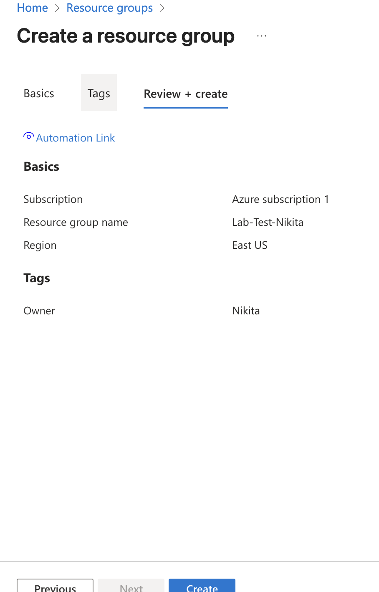
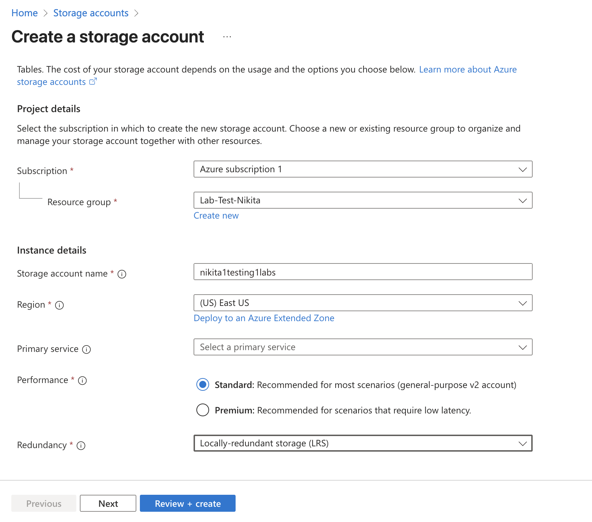
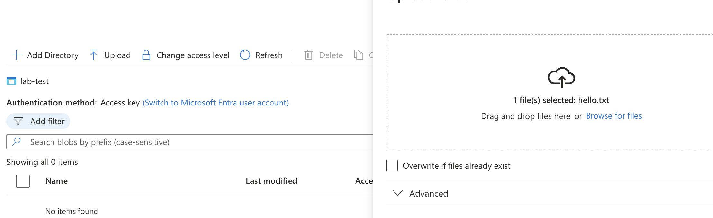
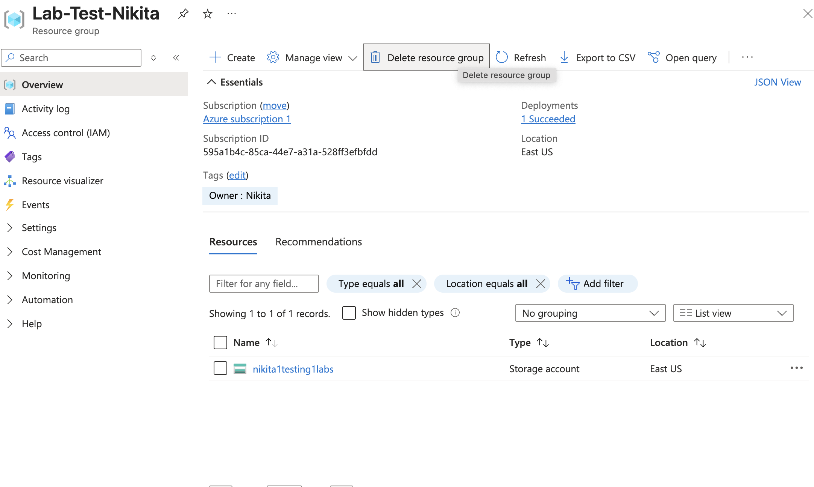

## Welcome to Part 1: Setting Up Your First Resource Group in Azure
In this first part, we’re diving into the basics of Azure by setting up a Resource Group. This is the first step in organizing everything in Azure, as it acts like a container that helps keep all your resources together and easy to manage. It’s a simple, but crucial part of getting your Azure environment set up the right way.

Whether you’re just starting with Azure or want to get your resources more organized, this guide will walk you through creating your first Resource Group, making it the perfect starting point for your Azure journey.

## Table of Contents

1. [Creating Resource Groups](#creating-resource-groups)
2. [Creating Storage Accounts](#creating-storage-accounts)
3. [Uploading Files to Azure Storage](#uploading-files-to-azure-storage)
4. [Next Steps and Cleanup](#next-steps-and-cleanup)

## Creating Resource Groups

A **Resource Group** in Azure is a logical container for your resources. It allows you to manage all your Azure resources in a structured way. You can think of it as a folder where you keep all your related resources.

### Steps to Create a Resource Group:
1. **Sign in** to the [Azure Portal](https://portal.azure.com/).
2. Navigate to **Resource Groups** in the left sidebar.
3. Click **+ Add** to create a new **Resource Group**.
4. Fill out the form:
   - **Name**: `Lab-Resource-Group` (choose your preferred name).
   - **Region**: Choose your preferred region (e.g., **East US**).
   - **Tag**: Optionally, add a **Tag** for organizational purposes. You could add **Owner: Nikita** here, or even an email if needed. This helps you identify who is responsible for managing the resource group.
   - **Redundancy**: For simplicity, select **Locally-redundant storage (LRS)**, which ensures your data is stored in three copies within a single data center in the selected region.
5. Click **Review + Create**, and then click **Create**.

**Screenshot 1**: 

---

## Creating Storage Accounts

An **Azure Storage Account** provides cloud storage that can be used for various data types like files, virtual machine disks, and backups. In this section, you’ll create a Storage Account to store your data.

### Steps to Create a Storage Account:
1. Navigate to **Storage Accounts** and click **+ Add** to create a new **Storage Account**.
2. In the **Subscription** and **Resource Group** sections, select the **Lab-Resource-Group** you created earlier.
3. Enter a **unique name** for your storage account (e.g., `labstorageaccount`).
   - The name must be **globally unique**, so you might need to adjust it slightly if it’s already taken.
4. For **Region**, select the same region as the Resource Group (e.g., **East US**).
5. Under **Performance**, select **Standard**.
6. Under **Replication**, choose **Locally Redundant Storage (LRS)**.
   - **LRS** keeps three copies of your data within the same data center, ensuring it's still available if one copy goes down.
7. Leave the rest of the settings as they are for simplicity.
8. Click **Review + Create**, and then click **Create**.

**Screenshot 2**: 

---

## Uploading Files to Azure Storage

Now that you’ve created the **Storage Account**, it’s time to upload a simple file to test the setup.

### Steps to Upload a File:
1. In the **Storage Account** page, go to **Containers**.
2. Click **+ Container** to create a new container (think of it as a folder in your storage account).
3. Name your container (e.g., `test-container`) and set the **Access level** to **Private (no anonymous access)**. Then click **OK**.
4. Once the container is created, click into it to open.
5. Inside the container, click **Upload** to upload a file.
   - Create a simple **text file** (e.g., `testfile.txt`) using a text editor. If you're a **Mac user**, make sure to save it as **plain text**.
   - Click **Browse**, select the file, and then click **Upload**.
6. Your file will now appear inside the container. It's in the cloud, and you can modify or replace it as needed.

**Screenshot 3**: 

---

## Next Steps and Cleanup

After you're done, it's important to clean up your resources to avoid unnecessary costs, especially if you're using a **pay-as-you-go** subscription. If you're using a **free account** like me (for studying purposes), you don’t need to worry, but it's always good practice to delete unused resources.

### Steps to Delete the Resource Group:
1. Go to **Resource Groups** and select `Lab-Resource-Group`.
2. Click **Delete** at the top.
3. Confirm the deletion to remove all resources within the group.

**Screenshot 4**: 

---

## Conclusion

Congratulations! You've successfully created a **Resource Group**, set up an **Azure Storage Account**, and uploaded a test file. This gives you a solid foundation for using Azure to organize, store, and manage resources. 

This guide is just the beginning. The next steps will cover creating and configuring virtual machines, networking, and much more!

---

## Additional Resources

- [Azure Documentation](https://learn.microsoft.com/en-us/azure/)
- [Azure Pricing](https://azure.microsoft.com/en-us/pricing/)
- [Azure Storage Pricing](https://azure.microsoft.com/en-us/pricing/details/storage/)

---

### How to Contribute

If you have any suggestions or improvements for the guide, feel free to open a pull request. All contributions are welcome!

---

### **Feedback**

If you have any questions or feedback about the guide, don’t hesitate to reach out to me at [dmitriev.nikitos@gmail.com].

