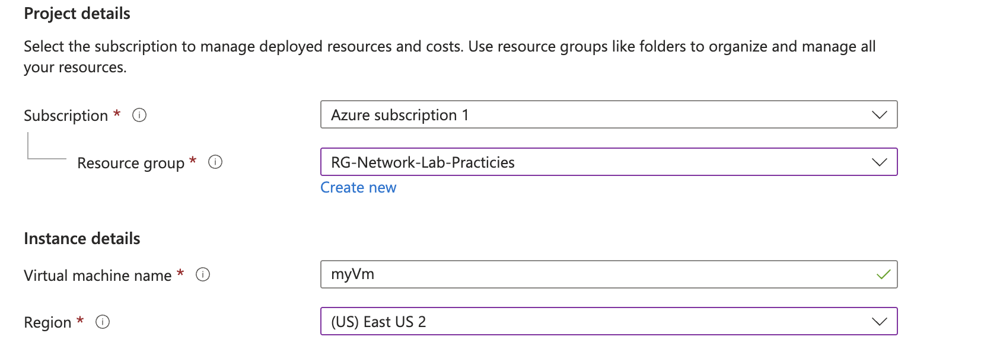
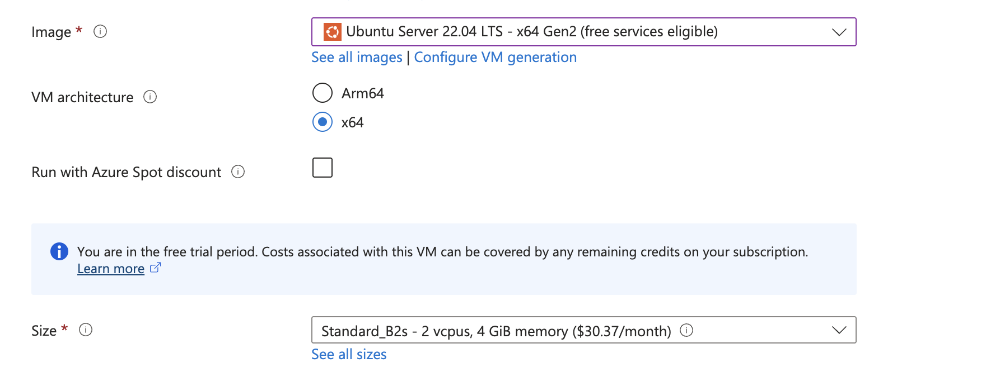
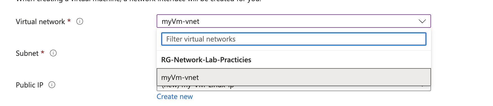
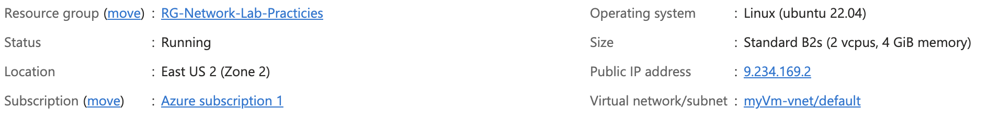
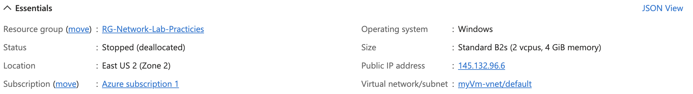

# Part 2: Setting Up Two Virtual Machines on the Same Network in Azure

In this guide, we’ll be setting up **two virtual machines (VMs)**one with **Windows 10** and the other with **Ubuntu Linux**— on the **same Virtual Network (VNet)** in **Azure**. We'll also create a **Virtual Network (VNet)** while setting up the VMs. By the end of this guide, you'll have two VMs on the same network, ready for further configurations in the next part!

---

## Step 1: Create the First Virtual Machine (Windows 10)

Let’s start by setting up the **Windows 10** VM. This process is pretty straightforward in Azure!

1. **Go to the Azure Portal** and click on **Virtual Machines**.
2. Click **+ Add** to start creating a new VM.
3. For the **Resource Group**, select the one we created earlier.
4. Give the **VM** a name (e.g., `Windows-VM`).
5. Choose **Region** (make sure it’s the same region as the Resource Group).
6. For **Image**, select **Windows 10 Pro** (make sure it’s eligible for the free trial if you’re using that).
7. For **Size**, select a **VM with at least 2 CPUs** (it’ll run smoother). If you’re using the free version, select whatever size is available to you.
   - **Screenshot**: 
8. For **Authentication Type**, select **Username/Password**. Enter your credentials.
9. Click **Next** for the **Disks** tab and leave the default settings.
10. For **Networking**, Azure will automatically create a **Virtual Network** for you (named something like `windows-vm-vnet`).
   - **Screenshot**:
11. Click **Review + Create**, and then **Create**.

While the **Windows VM** is being created, you can head over to the **Resource Group** and see all the resources being created, like the **Virtual Network**, **Public IP address**, **Network Interface**, and **Disk**.

---

## Step 2: Create the Second Virtual Machine (Ubuntu Linux)

Next, let’s create the **Linux Ubuntu** VM, making sure it’s connected to the same **Virtual Network** as the Windows VM.

1. Go to **Virtual Machines** in the Azure Portal and click **+ Add** to create a new VM.
2. Select the **same Resource Group** (`Lab-Resource-Group`) for consistency.
3. Give the VM a name, like `Linux-VM`.
4. Choose the **same region** as your first VM (e.g., **East US**).
5. For **Image**, select **Ubuntu** (you can choose any version of Ubuntu).
6. For **Size**, you can choose a smaller one than the Windows VM, but I kept it the same for consistency.
   - **Screenshot**: 
7. Choose **Username/Password** for **Authentication Type** and use the same credentials as for the Windows VM to keep it easy.
8. Click **Next** for **Disks**, and leave everything the same.
9. For **Networking**, select the **Virtual Network** that was automatically created for the Windows VM.
   - **Note**: If the network doesn’t show up immediately, wait a few minutes for it to appear, or make sure you’re using the same region for both VMs.
   - **Screenshot**: 
10. Click **Review + Create** and then **Create**.

---

## Step 3: Verify Both VMs Are on the Same Network

After both VMs are created, go back to your **Resource Group**. You’ll see both **Windows-VM** and **Linux-VM** listed there, and they should be on the **same Virtual Network** (the **windows-vm-vnet** network we created earlier).

- **Screenshot**: 
- **Screenshot**: 

---

## Step 4: Done for Now!

Great! You’ve now got two VMs—**one running Windows 10** and the other **running Ubuntu Linux** -on the **same Virtual Network**. These VMs are ready for future configurations, so keep them running as we’ll use them in **Part 3** for monitoring network traffic and setting up security.

---

## Conclusion

You’ve successfully created two virtual machines in **Azure** on the same **Virtual Network**! In this guide, we:
- Created a **Windows 10 VM** and a **Linux Ubuntu VM**.
- Ensured both VMs were connected to the **same Virtual Network**.
---
